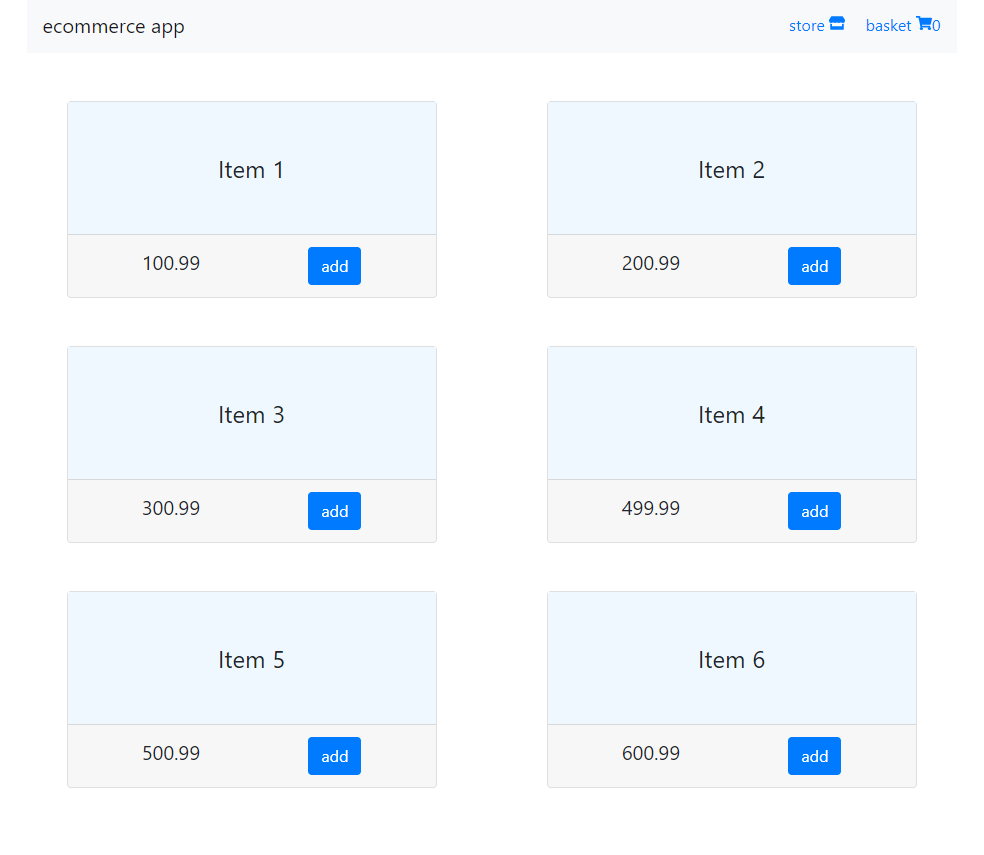
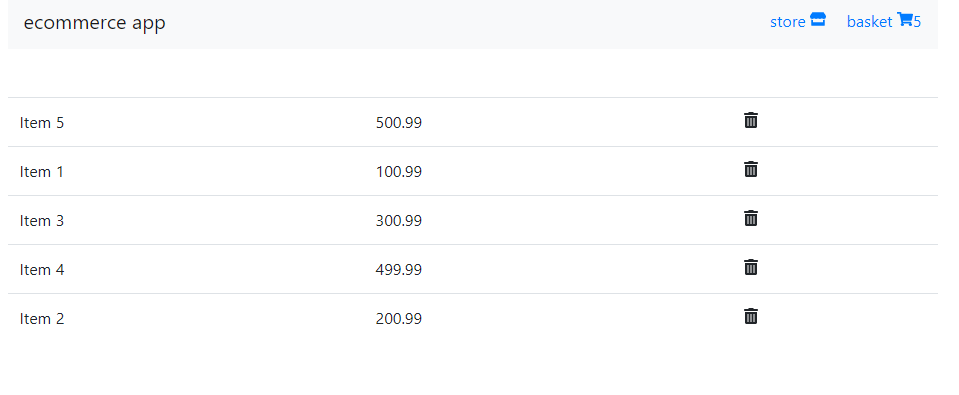

# React Hooks TypeScript Ecommerce Boilerplate

## Technologies

- React with Hooks (useState, useContext, useReducer, useEffect);
- React-Router-Dom
- TypeScript 3.5
- Bootstrap 4
- Styled Components
- ESLint

## Screens

##

##

## License MIT

### Project in progress
